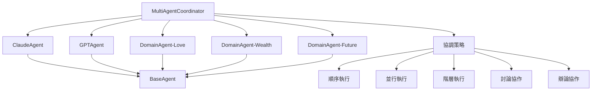

# Multi-Agent 系統逐行程式碼解析總結

## 📋 解析概述

本次解析涵蓋了 Multi-Agent 系統的核心檔案，深入分析了每個組件的架構設計、實現邏輯和協作機制。

## 📁 已解析檔案清單

### 1. `base_agent.py` - 基礎代理抽象類
**檔案路徑**: `src/agents/base_agent.py`  
**核心功能**: 定義所有 Agent 的基礎抽象類和共同介面  
**設計模式**: 抽象工廠模式 + 模板方法模式 + 策略模式  

**關鍵組件**:
- `AgentRole` - Agent 角色枚舉
- `AgentStatus` - Agent 狀態管理
- `AgentMessage/Response/Task` - 數據傳輸對象
- `BaseAgent` - 抽象基類
- `AgentMetrics` - 性能指標管理

### 2. `claude_agent.py` - Claude 邏輯推理代理
**檔案路徑**: `src/agents/claude_agent.py`  
**核心功能**: 基於 Claude AI 的邏輯推理和深度分析代理  
**設計模式**: 繼承模式 + 策略模式 + 適配器模式  

**專業能力**:
- 邏輯推理 (logical_reasoning)
- 深度分析 (deep_analysis)
- 模式識別 (pattern_recognition)
- 結構化思考 (structured_thinking)

**專業領域**:
- 紫微斗數理論分析
- 命理邏輯推理
- 星曜關係分析
- 格局判斷

### 3. `gpt_agent.py` - GPT 創意解釋代理
**檔案路徑**: `src/agents/gpt_agent.py`  
**核心功能**: 基於 OpenAI GPT 的創意解釋和靈活表達代理  
**設計模式**: 繼承模式 + 策略模式 + 適配器模式  

**專業能力**:
- 創意解釋 (creative_interpretation)
- 靈活表達 (flexible_expression)
- 故事創作 (storytelling)
- 比喻生成 (metaphor_generation)
- 個性化建議 (personalized_advice)

**專業領域**:
- 命理故事化表達
- 個性化建議
- 生活化解釋
- 情感共鳴

### 4. `domain_agent.py` - 專業領域代理
**檔案路徑**: `src/agents/domain_agent.py`  
**核心功能**: 基於特定領域專業知識的專家代理  
**設計模式**: 繼承模式 + 策略模式 + 工廠模式  

**領域專業化**:
- **愛情領域**: 感情宮位分析、桃花星解讀、婚姻運勢
- **財富領域**: 財帛宮分析、事業運勢、財運規劃
- **未來領域**: 大限流年、運勢預測、人生規劃
- **綜合領域**: 全方位分析、整體指導

### 5. `coordinator.py` - 多智能體協調器
**檔案路徑**: `src/agents/coordinator.py`  
**核心功能**: Multi-Agent 系統的核心協調器，管理 Agent 間的協作  
**設計模式**: 協調器模式 + 策略模式 + 觀察者模式 + 工廠模式  

**協調策略**:
- `SEQUENTIAL` - 順序執行
- `PARALLEL` - 並行執行
- `HIERARCHICAL` - 階層式執行
- `DISCUSSION` - 討論式協作
- `DEBATE` - 辯論式協作

## 🏗️ 系統架構總覽

## 🎯 核心設計模式

### 1. 抽象工廠模式
- **BaseAgent**: 定義所有 Agent 的統一介面
- **Agent 工廠**: 根據類型創建不同的 Agent 實例

### 2. 策略模式
- **協調策略**: 五種不同的執行策略
- **任務處理**: 根據任務類型選擇處理策略

### 3. 模板方法模式
- **任務處理流程**: 驗證 → 預處理 → 處理 → 後處理
- **協調流程**: 準備任務 → 分配 Agent → 執行策略 → 整合結果

### 4. 適配器模式
- **API 適配**: 將不同 AI 服務的 API 適配到統一介面
- **數據轉換**: 內部數據格式與外部 API 格式的轉換

### 5. 觀察者模式
- **狀態監控**: 監控 Agent 狀態變化
- **討論過程**: 監控討論輪次和共識程度

## 🔄 協作機制

### 1. 討論式協作 (Discussion)
- **多輪討論**: 支援最多 3 輪的深度討論
- **共識評估**: 基於關鍵詞重疊和情感一致性
- **早期終止**: 達到共識閾值時提前結束

### 2. 辯論式協作 (Debate)
- **立場陳述**: 第一輪各 Agent 陳述立場
- **挑戰反駁**: 後續輪次互相挑戰觀點
- **綜合結論**: 整合辯論過程形成綜合見解

### 3. 階層式執行 (Hierarchical)
- **三層架構**: 邏輯分析 → 專業分析 → 創意解釋
- **上下文傳遞**: 上層結果作為下層輸入
- **並行優化**: 同層內部並行執行

## 📊 性能與監控

### 1. 性能指標
- **AgentMetrics**: 任務統計、成功率、處理時間
- **協調指標**: 總執行時間、參與 Agent 數量、討論輪數

### 2. 健康檢查
- **Agent 健康**: 定期檢查每個 Agent 的健康狀態
- **系統監控**: 整體系統的運行狀態監控

### 3. 資源管理
- **生命週期**: 完整的 Agent 生命週期管理
- **資源清理**: 自動清理 Agent 和協調器資源

## 🎨 特色功能

### 1. 智能協作
- **角色分工**: 每個 Agent 有明確的角色和專業領域
- **協作討論**: Agent 間可以進行深度討論和辯論
- **共識達成**: 智能評估和達成共識

### 2. 靈活配置
- **策略選擇**: 可根據任務特性選擇執行策略
- **參數調整**: 討論輪數、共識閾值等可配置
- **Agent 啟用**: 可選擇性啟用不同的 Agent

### 3. 結果整合
- **多角度分析**: 邏輯、創意、專業三個角度
- **結構化輸出**: Markdown 格式的結構化結果
- **洞察提取**: 自動提取關鍵洞察和分歧點

## 🚀 使用場景

### 1. 紫微斗數分析
- **多角度解讀**: 邏輯推理 + 創意表達 + 專業分析
- **領域專精**: 愛情、財富、未來三大專業領域
- **深度討論**: Agent 間的專業討論和辯論

### 2. 複雜決策支援
- **多方觀點**: 不同 Agent 提供不同角度的分析
- **共識達成**: 通過討論達成一致性結論
- **風險評估**: 識別潛在的分歧和風險點

### 3. 知識整合
- **專業知識**: 整合不同領域的專業知識
- **創意表達**: 將專業知識轉化為易懂的表達
- **個性化服務**: 根據用戶特點提供個性化建議

## 🔧 技術特點

### 1. 異步架構
- **高並發**: 支援大規模並行處理
- **非阻塞**: 異步 I/O 提高系統響應性
- **資源效率**: 高效的資源利用率

### 2. 類型安全
- **完整類型提示**: 所有函數和類都有完整的類型註解
- **數據驗證**: 嚴格的輸入數據驗證
- **錯誤處理**: 完善的異常處理機制

### 3. 可擴展性
- **模組化設計**: 每個組件都是獨立的模組
- **介面統一**: 統一的 Agent 介面便於擴展
- **配置驅動**: 通過配置文件控制系統行為

## 📈 未來發展方向

### 1. 功能擴展
- **更多 Agent**: 添加更多專業領域的 Agent
- **新協調策略**: 開發新的協調和協作策略
- **智能路由**: 更智能的任務分配和路由機制

### 2. 性能優化
- **緩存機制**: 添加結果緩存提高響應速度
- **負載均衡**: 智能的負載均衡和資源調度
- **並行優化**: 進一步優化並行執行效率

### 3. 用戶體驗
- **實時反饋**: 實時顯示協調和討論過程
- **可視化**: 協作過程和結果的可視化展示
- **互動性**: 用戶可參與 Agent 討論過程

這個 Multi-Agent 系統展現了現代 AI 協作的先進理念，通過多智能體的協同工作，實現了比單一 AI 更豐富、更全面、更可靠的分析結果。
