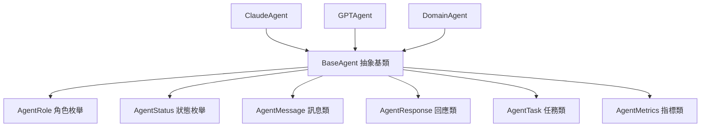

# BaseAgent 基礎代理類逐行程式碼解析

## 📋 檔案概述

**檔案路徑**: `src/agents/base_agent.py`  
**檔案作用**: 定義所有 Agent 的基礎抽象類和共同介面  
**設計模式**: 抽象工廠模式 + 模板方法模式 + 策略模式  
**核心概念**: Agent 架構的基礎框架，提供統一的介面和行為規範

## 🏗️ 整體架構



## 📝 逐行程式碼解析

### 🔧 導入與基礎設定 (第1-12行)

```python
"""
基礎Agent類別
定義所有Agent的共同介面和行為
"""
```
**用意**: 檔案文檔字符串，說明此檔案定義了 Agent 系統的基礎架構

```python
from abc import ABC, abstractmethod
from typing import Dict, Any, List, Optional
from dataclasses import dataclass
from enum import Enum
import logging
import asyncio
```

**架構設計**:
- `abc.ABC, abstractmethod`: 實現抽象基類模式，強制子類實現特定方法
- `typing`: 提供完整的類型提示，增強代碼安全性
- `dataclasses`: 簡化數據類的創建，減少樣板代碼
- `enum.Enum`: 定義枚舉類型，確保常量的類型安全
- `logging`: 統一的日誌記錄系統
- `asyncio`: 支援異步編程模式

### 🎭 Agent 角色定義 (第13-21行)

```python
class AgentRole(Enum):
    """Agent角色類型"""
    REASONING_ANALYSIS = "reasoning_analysis"
    CREATIVE_INTERPRETATION = "creative_interpretation"
    PROFESSIONAL_EXPERTISE = "professional_expertise"
    ANALYST = "analyst"  # 分析師角色
    CREATIVE = "creative"  # 創意角色
    EXPERT = "expert"  # 專家角色
```

**架構設計**:
- **枚舉模式**: 確保角色類型的唯一性和一致性
- **語義化命名**: 清晰表達每個角色的職責
- **擴展性**: 易於添加新的角色類型

**角色職責**:
- `REASONING_ANALYSIS`: 邏輯推理和深度分析
- `CREATIVE_INTERPRETATION`: 創意表達和人性化解釋
- `PROFESSIONAL_EXPERTISE`: 專業領域知識應用
- `ANALYST/CREATIVE/EXPERT`: 簡化的角色分類

### 📊 Agent 狀態管理 (第22-29行)

```python
class AgentStatus(Enum):
    """Agent狀態"""
    IDLE = "idle"
    THINKING = "thinking"
    PROCESSING = "processing"
    COMPLETED = "completed"
    ERROR = "error"
```

**架構設計**:
- **狀態機模式**: 清晰定義 Agent 的生命週期狀態
- **狀態追蹤**: 便於監控和調試 Agent 執行過程
- **錯誤處理**: 包含錯誤狀態便於異常處理

**狀態流轉**:
```
IDLE → THINKING → PROCESSING → COMPLETED
  ↓        ↓          ↓
ERROR ← ERROR ← ERROR
```

### 💬 訊息數據類 (第30-37行)

```python
@dataclass
class AgentMessage:
    """Agent訊息"""
    content: str
    message_type: str = "text"
    metadata: Optional[Dict[str, Any]] = None
    timestamp: Optional[str] = None
```

**架構設計**:
- **數據類模式**: 自動生成初始化和比較方法
- **類型安全**: 明確定義每個屬性的類型
- **可選屬性**: 提供默認值，增加使用靈活性

**屬性說明**:
- `content`: 訊息的主要內容
- `message_type`: 訊息類型（文本、圖片等）
- `metadata`: 額外的元數據信息
- `timestamp`: 訊息時間戳

### 📤 回應數據類 (第38-49行)

```python
@dataclass
class AgentResponse:
    """Agent回應"""
    agent_id: str
    role: AgentRole
    content: str
    confidence: float
    success: bool = True
    reasoning: Optional[str] = None
    metadata: Optional[Dict[str, Any]] = None
    processing_time: Optional[float] = None
```

**架構設計**:
- **結構化回應**: 統一的回應格式便於處理
- **信心度量**: `confidence` 字段表示回應的可信度
- **推理過程**: `reasoning` 字段記錄推理邏輯
- **性能監控**: `processing_time` 用於性能分析

### 📋 任務數據類 (第50-59行)

```python
@dataclass
class AgentTask:
    """Agent任務"""
    task_id: str
    task_type: str
    input_data: Dict[str, Any]
    context: Optional[Dict[str, Any]] = None
    priority: int = 1
    timeout: int = 60
```

**架構設計**:
- **任務封裝**: 將任務相關信息封裝在一個對象中
- **優先級管理**: `priority` 字段支援任務調度
- **超時控制**: `timeout` 防止任務無限執行
- **上下文傳遞**: `context` 提供額外的執行上下文

### 🤖 BaseAgent 抽象基類 (第60-83行)

```python
class BaseAgent(ABC):
    """基礎Agent抽象類別"""
    
    def __init__(self, 
                 agent_id: str,
                 role: AgentRole,
                 model_name: str,
                 logger: Optional[logging.Logger] = None):
        self.agent_id = agent_id
        self.role = role
        self.model_name = model_name
        self.status = AgentStatus.IDLE
        self.logger = logger or logging.getLogger(f"{__name__}.{agent_id}")
        
        # Agent能力和特性
        self.capabilities = []
        self.specializations = []
        self.max_context_length = 4000
        self.temperature = 0.7
```

**架構設計**:
- **抽象基類**: 使用 ABC 確保子類實現必要方法
- **依賴注入**: 通過構造函數注入依賴
- **配置管理**: 集中管理 Agent 的配置參數

**核心屬性**:
- `agent_id`: 唯一標識符
- `role`: Agent 角色類型
- `model_name`: 使用的 AI 模型名稱
- `status`: 當前狀態
- `capabilities`: 能力列表
- `specializations`: 專業領域列表
- `max_context_length`: 最大上下文長度
- `temperature`: 生成溫度參數

### 🔄 抽象方法定義 (第80-91行)

```python
@abstractmethod
async def process_task(self, task: AgentTask) -> AgentResponse:
    """處理任務 - 子類必須實現"""
    pass

@abstractmethod
async def generate_response(self, 
                          messages: List[AgentMessage], 
                          context: Optional[Dict[str, Any]] = None) -> str:
    """生成回應 - 子類必須實現"""
    pass
```

**架構設計**:
- **抽象方法模式**: 強制子類實現核心功能
- **異步設計**: 支援非阻塞的任務處理
- **統一介面**: 確保所有 Agent 有一致的調用方式

**方法職責**:
- `process_task`: 處理完整的任務流程
- `generate_response`: 生成 AI 回應內容

### 🔧 狀態管理方法 (第92-96行)

```python
def set_status(self, status: AgentStatus):
    """設置Agent狀態"""
    self.status = status
    self.logger.info(f"Agent {self.agent_id} status changed to {status.value}")
```

**架構設計**:
- **狀態封裝**: 通過方法控制狀態變更
- **日誌記錄**: 記錄狀態變化便於調試
- **類型安全**: 只接受 AgentStatus 枚舉值

### 🎯 能力管理方法 (第97-108行)

```python
def add_capability(self, capability: str):
    """添加能力"""
    if capability not in self.capabilities:
        self.capabilities.append(capability)
        self.logger.info(f"Added capability: {capability}")

def add_specialization(self, specialization: str):
    """添加專業領域"""
    if specialization not in self.specializations:
        self.specializations.append(specialization)
        self.logger.info(f"Added specialization: {specialization}")
```

**架構設計**:
- **動態配置**: 運行時動態添加能力和專業領域
- **重複檢查**: 避免重複添加相同的能力
- **日誌追蹤**: 記錄能力變更歷史

### ✅ 任務處理能力檢查 (第109-113行)

```python
def can_handle_task(self, task: AgentTask) -> bool:
    """檢查是否能處理任務"""
    # 基本檢查 - 子類可以覆寫
    return task.task_type in self.capabilities
```

**架構設計**:
- **能力匹配**: 根據任務類型檢查處理能力
- **可覆寫設計**: 子類可以實現更複雜的檢查邏輯
- **簡單實現**: 基類提供基本的匹配邏輯

## 🔍 數據處理方法

### 輸入驗證 (第114-127行)

```python
async def validate_input(self, input_data: Dict[str, Any]) -> bool:
    """驗證輸入數據"""
    try:
        # 基本驗證邏輯
        if not input_data:
            return False
        
        # 子類可以覆寫進行更詳細的驗證
        return True
        
    except Exception as e:
        self.logger.error(f"Input validation failed: {str(e)}")
        return False
```

**架構設計**:
- **防禦性編程**: 驗證所有輸入數據
- **異步設計**: 支援複雜的異步驗證邏輯
- **可擴展**: 子類可以覆寫實現特定驗證

### 數據預處理 (第128-132行)

```python
async def preprocess_input(self, input_data: Dict[str, Any]) -> Dict[str, Any]:
    """預處理輸入數據"""
    # 基本預處理 - 子類可以覆寫
    return input_data
```

**架構設計**:
- **模板方法模式**: 提供預處理的標準流程
- **可覆寫**: 子類可以實現特定的預處理邏輯
- **數據轉換**: 將原始數據轉換為處理所需格式

### 輸出後處理 (第133-137行)

```python
async def postprocess_output(self, output: str, context: Optional[Dict[str, Any]] = None) -> str:
    """後處理輸出"""
    # 基本後處理 - 子類可以覆寫
    return output.strip()
```

**架構設計**:
- **輸出清理**: 基本的輸出格式化
- **上下文感知**: 可以根據上下文調整輸出
- **可定制**: 子類可以實現複雜的後處理邏輯

## 🎯 系統提示詞與信息管理

### 系統提示詞生成 (第138-150行)

```python
def get_system_prompt(self) -> str:
    """獲取系統提示詞"""
    base_prompt = f"""你是一個專業的AI助手，角色是{self.role.value}。

你的特點：
- Agent ID: {self.agent_id}
- 專業領域: {', '.join(self.specializations) if self.specializations else '通用'}
- 核心能力: {', '.join(self.capabilities) if self.capabilities else '基礎分析'}

請根據你的角色和專業領域提供準確、有用的回應。"""

    return base_prompt
```

**架構設計**:
- **動態生成**: 根據 Agent 配置動態生成提示詞
- **角色定位**: 明確 Agent 的角色和職責
- **能力展示**: 列出 Agent 的專業領域和核心能力
- **模板化**: 提供標準的提示詞模板

### Agent 信息獲取 (第151-163行)

```python
def get_agent_info(self) -> Dict[str, Any]:
    """獲取Agent信息"""
    return {
        "agent_id": self.agent_id,
        "role": self.role.value,
        "model_name": self.model_name,
        "status": self.status.value,
        "capabilities": self.capabilities,
        "specializations": self.specializations,
        "max_context_length": self.max_context_length,
        "temperature": self.temperature
    }
```

**架構設計**:
- **信息封裝**: 將 Agent 的所有關鍵信息封裝在字典中
- **序列化友好**: 返回可序列化的數據結構
- **完整性**: 包含所有重要的配置和狀態信息
- **監控支援**: 便於系統監控和調試

### 健康檢查 (第164-175行)

```python
async def health_check(self) -> bool:
    """健康檢查"""
    try:
        # 基本健康檢查
        test_message = AgentMessage(content="健康檢查測試")
        response = await self.generate_response([test_message])
        return bool(response and len(response) > 0)

    except Exception as e:
        self.logger.error(f"Health check failed: {str(e)}")
        return False
```

**架構設計**:
- **主動檢測**: 通過實際調用檢測 Agent 健康狀態
- **異常處理**: 捕獲並記錄健康檢查中的異常
- **簡單測試**: 使用簡單的測試消息驗證基本功能
- **布爾返回**: 返回明確的健康狀態

## 📊 性能指標管理類

### AgentMetrics 初始化 (第176-187行)

```python
class AgentMetrics:
    """Agent性能指標"""

    def __init__(self, agent_id: str):
        self.agent_id = agent_id
        self.total_tasks = 0
        self.successful_tasks = 0
        self.failed_tasks = 0
        self.total_processing_time = 0.0
        self.average_processing_time = 0.0
        self.last_activity = None
```

**架構設計**:
- **指標收集**: 專門的類負責收集和管理性能指標
- **統計數據**: 記錄任務執行的各種統計信息
- **性能分析**: 支援平均處理時間等性能分析
- **活動追蹤**: 記錄最後活動時間

### 任務記錄方法 (第188-202行)

```python
def record_task_start(self):
    """記錄任務開始"""
    self.total_tasks += 1
    self.last_activity = asyncio.get_event_loop().time()

def record_task_success(self, processing_time: float):
    """記錄任務成功"""
    self.successful_tasks += 1
    self.total_processing_time += processing_time
    self.average_processing_time = self.total_processing_time / self.successful_tasks

def record_task_failure(self):
    """記錄任務失敗"""
    self.failed_tasks += 1
```

**架構設計**:
- **事件驅動**: 通過事件記錄的方式收集指標
- **實時計算**: 即時更新平均處理時間
- **時間追蹤**: 使用事件循環時間進行精確計時
- **分類統計**: 分別統計成功和失敗的任務

### 指標計算與獲取 (第203-220行)

```python
def get_success_rate(self) -> float:
    """獲取成功率"""
    if self.total_tasks == 0:
        return 0.0
    return self.successful_tasks / self.total_tasks

def get_metrics(self) -> Dict[str, Any]:
    """獲取所有指標"""
    return {
        "agent_id": self.agent_id,
        "total_tasks": self.total_tasks,
        "successful_tasks": self.successful_tasks,
        "failed_tasks": self.failed_tasks,
        "success_rate": self.get_success_rate(),
        "average_processing_time": self.average_processing_time,
        "last_activity": self.last_activity
    }
```

**架構設計**:
- **安全計算**: 避免除零錯誤的安全成功率計算
- **完整報告**: 提供所有關鍵指標的完整報告
- **標準格式**: 返回標準化的指標數據結構

## 🎯 設計模式總結

### 使用的設計模式

1. **抽象工廠模式**: `BaseAgent` 作為所有 Agent 的抽象基類
2. **模板方法模式**: 定義了 Agent 的標準處理流程
3. **策略模式**: 不同的 Agent 實現不同的處理策略
4. **狀態模式**: `AgentStatus` 管理 Agent 的狀態轉換
5. **數據傳輸對象模式**: 各種 `@dataclass` 封裝數據

### 架構優勢

1. **統一介面**: 所有 Agent 都有一致的調用方式
2. **類型安全**: 完整的類型提示和枚舉約束
3. **可擴展性**: 易於添加新的 Agent 類型和功能
4. **可監控性**: 內建的指標收集和健康檢查
5. **異步支援**: 完整的異步編程支援

### 核心概念

- **Agent 抽象**: 統一的 Agent 介面和行為規範
- **角色分工**: 明確的角色定義和職責劃分
- **狀態管理**: 完整的生命週期狀態管理
- **性能監控**: 內建的性能指標收集系統
- **錯誤處理**: 全面的異常處理和日誌記錄

### 使用場景

此基礎 Agent 類適用於：
- Multi-Agent 系統的基礎架構
- AI 助手的標準化實現
- 分散式任務處理系統
- 需要性能監控的 AI 應用
- 企業級 AI 服務架構
