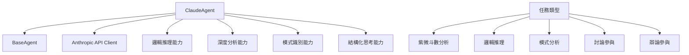

# ClaudeAgent 邏輯推理代理逐行程式碼解析

## 📋 檔案概述

**檔案路徑**: `src/agents/claude_agent.py`  
**檔案作用**: 實現基於 Claude AI 的邏輯推理和深度分析代理  
**設計模式**: 繼承模式 + 策略模式 + 適配器模式  
**核心概念**: 專精邏輯推理、深度分析、結構化思考的 AI 代理

## 🏗️ 整體架構



## 📝 逐行程式碼解析

### 🔧 導入與基礎設定 (第1-14行)

```python
"""
Claude Agent
專門負責邏輯推理和深度分析
"""

import asyncio
import time
from typing import Dict, Any, List, Optional
import anthropic
from .base_agent import BaseAgent, AgentRole, AgentStatus, AgentTask, AgentResponse, AgentMessage
from ..config.settings import get_settings

settings = get_settings()
```

**架構設計**:
- **專業定位**: 明確定義為邏輯推理和深度分析專家
- **異步支援**: 導入 `asyncio` 支援非阻塞操作
- **時間追蹤**: 導入 `time` 用於性能監控
- **API 整合**: 導入 `anthropic` 官方客戶端
- **繼承架構**: 從 `BaseAgent` 繼承基礎功能
- **配置管理**: 使用統一的設定管理系統

### 🤖 ClaudeAgent 類初始化 (第15-47行)

```python
class ClaudeAgent(BaseAgent):
    """Claude Agent - 專精邏輯推理和深度分析"""
    
    def __init__(self, agent_id: str = "claude_agent", logger=None):
        super().__init__(
            agent_id=agent_id,
            role=AgentRole.REASONING_ANALYSIS,
            model_name=settings.anthropic.model,
            logger=logger
        )
        
        # 初始化Claude客戶端
        self.client = anthropic.Anthropic(
            api_key=settings.anthropic.api_key,
            base_url=settings.anthropic.base_url
        )
        
        # Claude特有設定
        self.max_context_length = 200000  # Claude 3.5 Sonnet的上下文長度
        self.temperature = 0.3  # 較低溫度以確保邏輯性
        
        # 添加Claude的專業能力
        self.add_capability("logical_reasoning")
        self.add_capability("deep_analysis")
        self.add_capability("pattern_recognition")
        self.add_capability("structured_thinking")
        
        # 添加專業領域
        self.add_specialization("紫微斗數理論分析")
        self.add_specialization("命理邏輯推理")
        self.add_specialization("星曜關係分析")
        self.add_specialization("格局判斷")
```

**架構設計**:
- **繼承實現**: 繼承 `BaseAgent` 獲得基礎功能
- **角色定位**: 設定為 `REASONING_ANALYSIS` 角色
- **客戶端初始化**: 使用配置創建 Anthropic 客戶端
- **參數優化**: 設定較低溫度 (0.3) 確保邏輯性
- **能力註冊**: 註冊邏輯推理相關的核心能力
- **專業領域**: 專精紫微斗數的理論分析

**核心配置**:
- `max_context_length`: 200,000 tokens (Claude 3.5 Sonnet 的上下文長度)
- `temperature`: 0.3 (較低溫度確保邏輯一致性)
- 四大核心能力：邏輯推理、深度分析、模式識別、結構化思考
- 四大專業領域：理論分析、邏輯推理、星曜關係、格局判斷

### 🧠 回應生成方法 (第48-85行)

```python
async def generate_response(self, 
                          messages: List[AgentMessage], 
                          context: Optional[Dict[str, Any]] = None) -> str:
    """生成Claude回應"""
    try:
        self.set_status(AgentStatus.THINKING)
        
        # 構建Claude消息格式
        claude_messages = []
        
        # 添加系統提示詞
        system_prompt = self.get_claude_system_prompt(context)
        
        # 轉換消息格式
        for msg in messages:
            claude_messages.append({
                "role": "user",
                "content": msg.content
            })
        
        # 調用Claude API
        response = await asyncio.to_thread(
            self.client.messages.create,
            model=self.model_name,
            max_tokens=4000,
            temperature=self.temperature,
            system=system_prompt,
            messages=claude_messages
        )
        
        self.set_status(AgentStatus.COMPLETED)
        return response.content[0].text
        
    except Exception as e:
        self.set_status(AgentStatus.ERROR)
        self.logger.error(f"Claude response generation failed: {str(e)}")
        raise
```

**架構設計**:
- **狀態管理**: 明確的狀態轉換 (THINKING → COMPLETED/ERROR)
- **消息轉換**: 將內部消息格式轉換為 Claude API 格式
- **異步調用**: 使用 `asyncio.to_thread` 包裝同步 API 調用
- **系統提示詞**: 動態生成專業的系統提示詞
- **錯誤處理**: 完整的異常捕獲和狀態管理

**API 參數**:
- `max_tokens`: 4000 (適中的回應長度)
- `temperature`: 使用實例設定的溫度值
- `system`: 動態生成的系統提示詞
- `messages`: 轉換後的用戶消息列表

### 📋 任務處理方法 (第86-147行)

```python
async def process_task(self, task: AgentTask) -> AgentResponse:
    """處理任務"""
    start_time = time.time()
    
    try:
        self.set_status(AgentStatus.PROCESSING)
        
        # 驗證輸入
        if not await self.validate_input(task.input_data):
            raise ValueError("Invalid input data")
        
        # 預處理輸入
        processed_input = await self.preprocess_input(task.input_data)
        
        # 根據任務類型生成不同的分析
        if task.task_type == "ziwei_analysis":
            response_content = await self.analyze_ziwei_chart(processed_input, task.context)
        elif task.task_type == "logical_reasoning":
            response_content = await self.perform_logical_reasoning(processed_input, task.context)
        elif task.task_type == "pattern_analysis":
            response_content = await self.analyze_patterns(processed_input, task.context)
        elif task.task_type == "discussion_response":
            response_content = await self.participate_in_discussion(processed_input, task.context)
        elif task.task_type == "debate_response":
            response_content = await self.participate_in_debate(processed_input, task.context)
        else:
            # 通用分析
            messages = [AgentMessage(content=str(processed_input))]
            response_content = await self.generate_response(messages, task.context)
        
        # 後處理輸出
        final_response = await self.postprocess_output(response_content, task.context)
        
        processing_time = time.time() - start_time
        
        return AgentResponse(
            agent_id=self.agent_id,
            role=self.role,
            content=final_response,
            confidence=0.85,  # Claude通常有較高的邏輯準確性
            reasoning=f"使用Claude {self.model_name}進行邏輯推理和深度分析",
            metadata={
                "model": self.model_name,
                "temperature": self.temperature,
                "task_type": task.task_type
            },
            processing_time=processing_time
        )
        
    except Exception as e:
        self.set_status(AgentStatus.ERROR)
        self.logger.error(f"Task processing failed: {str(e)}")
        
        return AgentResponse(
            agent_id=self.agent_id,
            role=self.role,
            content=f"處理失敗: {str(e)}",
            confidence=0.0,
            reasoning="任務處理過程中發生錯誤",
            processing_time=time.time() - start_time
        )
```

**架構設計**:
- **策略模式**: 根據任務類型選擇不同的處理策略
- **流程標準化**: 驗證 → 預處理 → 處理 → 後處理的標準流程
- **性能監控**: 記錄完整的處理時間
- **信心度設定**: Claude 設定較高的信心度 (0.85)
- **錯誤恢復**: 異常情況下返回錯誤回應而非崩潰

**支援的任務類型**:
1. `ziwei_analysis`: 紫微斗數分析
2. `logical_reasoning`: 邏輯推理
3. `pattern_analysis`: 模式分析
4. `discussion_response`: 討論參與
5. `debate_response`: 辯論參與
6. 通用分析：其他類型的任務

## 🔍 專業分析方法

### 紫微斗數分析 (第148-176行)

```python
async def analyze_ziwei_chart(self, input_data: Dict[str, Any], context: Optional[Dict[str, Any]] = None) -> str:
    """分析紫微斗數命盤"""
    
    chart_data = input_data.get('chart_data', {})
    domain_type = input_data.get('domain_type', 'general')
    
    analysis_prompt = f"""請對以下紫微斗數命盤進行深度邏輯分析：

命盤數據：
{chart_data}

分析領域：{domain_type}

請從以下角度進行分析：
1. 命宮主星特質和基本性格分析
2. 三方四正的星曜配置邏輯
3. 四化星的影響和作用機制
4. 大限流年的運勢邏輯推演
5. 針對{domain_type}領域的專業分析

要求：
- 基於傳統紫微斗數理論進行邏輯推理
- 分析星曜之間的相互關係和影響
- 提供具體的邏輯依據和推理過程
- 避免過於絕對的預測，保持客觀理性"""

    messages = [AgentMessage(content=analysis_prompt)]
    return await self.generate_response(messages, context)
```

**架構設計**:
- **結構化分析**: 五個層次的系統性分析框架
- **理論基礎**: 強調基於傳統紫微斗數理論
- **邏輯要求**: 要求提供具體的邏輯依據和推理過程
- **客觀性**: 避免絕對預測，保持理性分析

**分析框架**:
1. 命宮主星特質分析
2. 三方四正配置邏輯
3. 四化星作用機制
4. 大限流年推演
5. 領域專業分析

### 邏輯推理方法 (第177-201行)

```python
async def perform_logical_reasoning(self, input_data: Dict[str, Any], context: Optional[Dict[str, Any]] = None) -> str:
    """執行邏輯推理"""

    reasoning_prompt = f"""請對以下問題進行邏輯推理：

問題：{input_data.get('question', '')}
背景信息：{input_data.get('background', '')}
已知條件：{input_data.get('conditions', [])}

請按照以下步驟進行推理：
1. 分析問題的核心要素
2. 識別關鍵的邏輯關係
3. 建立推理鏈條
4. 得出合理結論
5. 評估結論的可信度

要求：
- 使用清晰的邏輯結構
- 每一步推理都要有明確依據
- 考慮可能的反例或例外情況
- 提供推理的信心度評估"""

    messages = [AgentMessage(content=reasoning_prompt)]
    return await self.generate_response(messages, context)
```

**架構設計**:
- **五步推理法**: 系統性的邏輯推理流程
- **結構化思考**: 要求清晰的邏輯結構
- **證據支持**: 每步推理都需要明確依據
- **批判性思考**: 考慮反例和例外情況
- **信心度評估**: 提供推理結果的可信度

### 模式分析方法 (第202-224行)

```python
async def analyze_patterns(self, input_data: Dict[str, Any], context: Optional[Dict[str, Any]] = None) -> str:
    """分析模式和規律"""

    pattern_prompt = f"""請分析以下數據中的模式和規律：

數據：{input_data.get('data', '')}
分析目標：{input_data.get('target', '')}

請進行以下分析：
1. 識別明顯的模式和趨勢
2. 分析模式背後的邏輯原因
3. 預測可能的發展方向
4. 評估模式的穩定性和可靠性

要求：
- 使用統計和邏輯方法
- 提供具體的證據支持
- 考慮異常值和例外情況
- 給出信心度評估"""

    messages = [AgentMessage(content=pattern_prompt)]
    return await self.generate_response(messages, context)
```

**架構設計**:
- **四層分析**: 識別 → 原因 → 預測 → 評估
- **方法論**: 結合統計和邏輯方法
- **證據導向**: 要求具體的證據支持
- **異常處理**: 考慮異常值和例外情況

## 🎯 系統提示詞與能力檢查

### Claude 專用系統提示詞 (第225-255行)

```python
def get_claude_system_prompt(self, context: Optional[Dict[str, Any]] = None) -> str:
    """獲取Claude專用的系統提示詞"""

    base_prompt = f"""你是一位專精於邏輯推理和深度分析的AI助手。

你的核心特質：
- 擅長邏輯推理和批判性思考
- 能夠進行深度的結構化分析
- 具備強大的模式識別能力
- 在紫微斗數理論方面有深厚造詣

你的分析方法：
1. 系統性思考：將複雜問題分解為可管理的部分
2. 邏輯推理：使用嚴謹的邏輯鏈條進行推演
3. 證據支持：每個結論都要有充分的理論依據
4. 客觀理性：避免主觀臆測，保持中立立場

在紫微斗數分析中，你特別擅長：
- 星曜特質的深度解析
- 宮位關係的邏輯分析
- 格局判斷的理論依據
- 運勢推演的邏輯基礎

請始終保持邏輯性、準確性和專業性。"""

    if context and context.get('domain_type'):
        domain_type = context['domain_type']
        base_prompt += f"\n\n當前分析領域：{domain_type}\n請特別關注與{domain_type}相關的星曜和宮位分析。"

    return base_prompt
```

**架構設計**:
- **角色定位**: 明確定義為邏輯推理和深度分析專家
- **核心特質**: 四大核心能力的詳細描述
- **方法論**: 四步分析方法的系統化描述
- **專業領域**: 紫微斗數的四大專精方向
- **動態調整**: 根據上下文動態調整提示詞

### 任務處理能力檢查 (第256-269行)

```python
def can_handle_task(self, task: AgentTask) -> bool:
    """檢查是否能處理任務"""
    claude_tasks = [
        "ziwei_analysis",
        "logical_reasoning",
        "pattern_analysis",
        "deep_analysis",
        "structured_thinking",
        "discussion_response",
        "debate_response"
    ]

    return task.task_type in claude_tasks or super().can_handle_task(task)
```

**架構設計**:
- **能力清單**: 明確列出 Claude Agent 能處理的任務類型
- **繼承支援**: 通過 `super()` 支援基類的能力檢查
- **擴展性**: 易於添加新的任務類型

## 💬 協作與討論功能

### 討論參與方法 (第270-292行)

```python
async def participate_in_discussion(self, input_data: Dict[str, Any], context: Optional[Dict[str, Any]] = None) -> str:
    """參與討論"""

    discussion_context = input_data.get('discussion_context', '')
    round_number = input_data.get('round_number', 1)
    domain_type = input_data.get('domain_type', 'general')

    discussion_prompt = f"""作為邏輯推理專家，請參與以下紫微斗數討論：

{discussion_context}

這是第 {round_number} 輪討論，請您：

1. **邏輯分析**：從邏輯推理的角度分析其他 Agent 的觀點
2. **補充見解**：提出其他 Agent 可能遺漏的邏輯要點
3. **理論支撐**：用紫微斗數理論支持您的觀點
4. **建設性回應**：對其他觀點進行建設性的補充或修正

請保持專業、客觀的態度，重點關注邏輯的嚴謹性和理論的準確性。"""

    messages = [AgentMessage(content=discussion_prompt)]
    return await self.generate_response(messages, context)
```

**架構設計**:
- **角色明確**: 以邏輯推理專家身份參與討論
- **四大職責**: 邏輯分析、補充見解、理論支撐、建設性回應
- **輪次感知**: 根據討論輪次調整參與策略
- **專業態度**: 強調專業性和客觀性

### 辯論參與方法 (第293-315行)

```python
async def participate_in_debate(self, input_data: Dict[str, Any], context: Optional[Dict[str, Any]] = None) -> str:
    """參與辯論"""

    debate_context = input_data.get('debate_context', '')
    round_number = input_data.get('round_number', 1)
    domain_type = input_data.get('domain_type', 'general')

    debate_prompt = f"""作為邏輯推理專家，請參與以下紫微斗數辯論：

{debate_context}

這是第 {round_number} 輪辯論，請您：

1. **邏輯檢驗**：檢驗其他 Agent 觀點的邏輯漏洞
2. **理論挑戰**：用更嚴謹的紫微斗數理論挑戰不準確的解釋
3. **證據支持**：提供更有力的證據支持您的立場
4. **反駁論證**：對不同觀點進行有理有據的反駁

請保持學術辯論的風格，重點在於追求真理和準確性，而非單純的對抗。"""

    messages = [AgentMessage(content=debate_prompt)]
    return await self.generate_response(messages, context)
```

**架構設計**:
- **辯論角色**: 以邏輯推理專家身份參與辯論
- **四大策略**: 邏輯檢驗、理論挑戰、證據支持、反駁論證
- **學術風格**: 強調追求真理而非對抗
- **建設性辯論**: 重點在於準確性和真理

### 資源清理方法 (第316-324行)

```python
async def cleanup(self):
    """清理 Claude Agent 資源"""
    try:
        # Claude 客戶端通常不需要特殊清理，但我們可以重置狀態
        self.set_status(AgentStatus.IDLE)
        self.logger.info(f"Claude Agent {self.agent_id} 清理完成")
    except Exception as e:
        self.logger.error(f"Claude Agent 清理失敗: {str(e)}")
```

**架構設計**:
- **狀態重置**: 將 Agent 狀態重置為 IDLE
- **日誌記錄**: 記錄清理操作的結果
- **異常處理**: 捕獲清理過程中的異常

## 🎯 設計模式總結

### 使用的設計模式

1. **繼承模式**: 繼承 `BaseAgent` 獲得基礎功能
2. **策略模式**: 根據任務類型選擇不同的處理策略
3. **適配器模式**: 適配 Anthropic API 到內部介面
4. **模板方法模式**: 標準化的任務處理流程
5. **工廠方法模式**: 動態生成系統提示詞

### 架構優勢

1. **專業化**: 專精邏輯推理和深度分析
2. **結構化**: 系統性的分析方法和流程
3. **協作性**: 支援討論和辯論等協作功能
4. **可配置**: 動態的系統提示詞和參數調整
5. **可監控**: 完整的狀態管理和性能追蹤

### 核心特色

- **邏輯推理**: 擅長嚴謹的邏輯分析和推演
- **深度分析**: 能夠進行多層次的結構化分析
- **理論基礎**: 基於紫微斗數理論的專業分析
- **批判思考**: 具備檢驗邏輯漏洞的能力
- **協作能力**: 支援多 Agent 協作討論和辯論

### 使用場景

此 Claude Agent 適用於：
- 需要邏輯推理的複雜分析任務
- 紫微斗數的理論分析和解釋
- Multi-Agent 系統中的邏輯檢驗角色
- 需要深度分析的專業諮詢
- 學術討論和辯論場景
