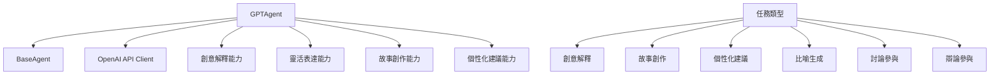

# GPTAgent 創意解釋代理逐行程式碼解析

## 📋 檔案概述

**檔案路徑**: `src/agents/gpt_agent.py`  
**檔案作用**: 實現基於 OpenAI GPT 的創意解釋和靈活表達代理  
**設計模式**: 繼承模式 + 策略模式 + 適配器模式  
**核心概念**: 專精創意解釋、靈活表達、故事化描述、個性化建議的 AI 代理

## 🏗️ 整體架構



## 📝 逐行程式碼解析

### 🔧 導入與基礎設定 (第1-14行)

```python
"""
GPT Agent
專門負責創意解釋和靈活表達
"""

import asyncio
import time
from typing import Dict, Any, List, Optional
import openai
from .base_agent import BaseAgent, AgentRole, AgentStatus, AgentTask, AgentResponse, AgentMessage
from ..config.settings import get_settings

settings = get_settings()
```

**架構設計**:
- **專業定位**: 明確定義為創意解釋和靈活表達專家
- **異步支援**: 導入 `asyncio` 支援非阻塞操作
- **性能監控**: 導入 `time` 用於處理時間追蹤
- **API 整合**: 導入 `openai` 官方客戶端
- **繼承架構**: 從 `BaseAgent` 繼承基礎功能
- **配置管理**: 使用統一的設定管理系統

### 🎨 GPTAgent 類初始化 (第15-48行)

```python
class GPTAgent(BaseAgent):
    """GPT Agent - 專精創意解釋和靈活表達"""
    
    def __init__(self, agent_id: str = "gpt_agent", logger=None):
        super().__init__(
            agent_id=agent_id,
            role=AgentRole.CREATIVE_INTERPRETATION,
            model_name=settings.openai.model_gpt4,
            logger=logger
        )
        
        # 初始化OpenAI客戶端
        self.client = openai.AsyncOpenAI(
            api_key=settings.openai.api_key,
            base_url=settings.openai.base_url
        )
        
        # GPT特有設定
        self.max_context_length = 128000  # GPT-4 Turbo的上下文長度
        self.temperature = 0.8  # 較高溫度以增加創意性
        
        # 添加GPT的專業能力
        self.add_capability("creative_interpretation")
        self.add_capability("flexible_expression")
        self.add_capability("storytelling")
        self.add_capability("metaphor_generation")
        self.add_capability("personalized_advice")
        
        # 添加專業領域
        self.add_specialization("命理故事化表達")
        self.add_specialization("個性化建議")
        self.add_specialization("生活化解釋")
        self.add_specialization("情感共鳴")
```

**架構設計**:
- **繼承實現**: 繼承 `BaseAgent` 獲得基礎功能
- **角色定位**: 設定為 `CREATIVE_INTERPRETATION` 角色
- **異步客戶端**: 使用 `AsyncOpenAI` 支援異步操作
- **創意參數**: 設定較高溫度 (0.8) 增加創意性
- **能力註冊**: 註冊創意表達相關的核心能力
- **專業領域**: 專精命理的人性化表達

**核心配置**:
- `max_context_length`: 128,000 tokens (GPT-4 Turbo 的上下文長度)
- `temperature`: 0.8 (較高溫度增加創意性和多樣性)
- 五大核心能力：創意解釋、靈活表達、故事創作、比喻生成、個性化建議
- 四大專業領域：故事化表達、個性化建議、生活化解釋、情感共鳴

### 🎭 回應生成方法 (第49-91行)

```python
async def generate_response(self, 
                          messages: List[AgentMessage], 
                          context: Optional[Dict[str, Any]] = None) -> str:
    """生成GPT回應"""
    try:
        self.set_status(AgentStatus.THINKING)
        
        # 構建GPT消息格式
        gpt_messages = []
        
        # 添加系統提示詞
        system_prompt = self.get_gpt_system_prompt(context)
        gpt_messages.append({
            "role": "system",
            "content": system_prompt
        })
        
        # 轉換消息格式
        for msg in messages:
            gpt_messages.append({
                "role": "user",
                "content": msg.content
            })
        
        # 調用GPT API
        response = await self.client.chat.completions.create(
            model=self.model_name,
            messages=gpt_messages,
            max_tokens=4000,
            temperature=self.temperature,
            top_p=0.9,
            frequency_penalty=0.1,
            presence_penalty=0.1
        )
        
        self.set_status(AgentStatus.COMPLETED)
        return response.choices[0].message.content
        
    except Exception as e:
        self.set_status(AgentStatus.ERROR)
        self.logger.error(f"GPT response generation failed: {str(e)}")
        raise
```

**架構設計**:
- **狀態管理**: 明確的狀態轉換 (THINKING → COMPLETED/ERROR)
- **消息構建**: 將系統提示詞和用戶消息組合
- **異步調用**: 使用異步 OpenAI 客戶端
- **創意參數**: 設定多個參數控制生成質量
- **錯誤處理**: 完整的異常捕獲和狀態管理

**API 參數優化**:
- `max_tokens`: 4000 (適中的回應長度)
- `temperature`: 0.8 (高創意性)
- `top_p`: 0.9 (核採樣，平衡多樣性和質量)
- `frequency_penalty`: 0.1 (減少重複)
- `presence_penalty`: 0.1 (鼓勵新話題)

### 📋 任務處理方法 (第92-155行)

```python
async def process_task(self, task: AgentTask) -> AgentResponse:
    """處理任務"""
    start_time = time.time()
    
    try:
        self.set_status(AgentStatus.PROCESSING)
        
        # 驗證輸入
        if not await self.validate_input(task.input_data):
            raise ValueError("Invalid input data")
        
        # 預處理輸入
        processed_input = await self.preprocess_input(task.input_data)
        
        # 根據任務類型生成不同的創意解釋
        if task.task_type == "creative_interpretation":
            response_content = await self.create_interpretation(processed_input, task.context)
        elif task.task_type == "storytelling":
            response_content = await self.create_story(processed_input, task.context)
        elif task.task_type == "personalized_advice":
            response_content = await self.generate_advice(processed_input, task.context)
        elif task.task_type == "metaphor_generation":
            response_content = await self.generate_metaphors(processed_input, task.context)
        elif task.task_type == "discussion_response":
            response_content = await self.participate_in_discussion(processed_input, task.context)
        elif task.task_type == "debate_response":
            response_content = await self.participate_in_debate(processed_input, task.context)
        else:
            # 通用創意表達
            messages = [AgentMessage(content=str(processed_input))]
            response_content = await self.generate_response(messages, task.context)
        
        # 後處理輸出
        final_response = await self.postprocess_output(response_content, task.context)
        
        processing_time = time.time() - start_time
        
        return AgentResponse(
            agent_id=self.agent_id,
            role=self.role,
            content=final_response,
            confidence=0.75,  # GPT在創意表達方面有良好表現
            reasoning=f"使用GPT {self.model_name}進行創意解釋和靈活表達",
            metadata={
                "model": self.model_name,
                "temperature": self.temperature,
                "task_type": task.task_type
            },
            processing_time=processing_time
        )
        
    except Exception as e:
        self.set_status(AgentStatus.ERROR)
        self.logger.error(f"Task processing failed: {str(e)}")
        
        return AgentResponse(
            agent_id=self.agent_id,
            role=self.role,
            content=f"處理失敗: {str(e)}",
            confidence=0.0,
            reasoning="任務處理過程中發生錯誤",
            processing_time=time.time() - start_time
        )
```

**架構設計**:
- **策略模式**: 根據任務類型選擇不同的創意處理策略
- **流程標準化**: 驗證 → 預處理 → 處理 → 後處理的標準流程
- **性能監控**: 記錄完整的處理時間
- **信心度設定**: GPT 設定中等信心度 (0.75)
- **錯誤恢復**: 異常情況下返回錯誤回應而非崩潰

**支援的任務類型**:
1. `creative_interpretation`: 創意解釋
2. `storytelling`: 故事創作
3. `personalized_advice`: 個性化建議
4. `metaphor_generation`: 比喻生成
5. `discussion_response`: 討論參與
6. `debate_response`: 辯論參與
7. 通用創意表達：其他類型的任務

## 🎨 創意表達方法

### 創意解釋方法 (第156-187行)

```python
async def create_interpretation(self, input_data: Dict[str, Any], context: Optional[Dict[str, Any]] = None) -> str:
    """創建創意解釋"""
    
    analysis_data = input_data.get('analysis_data', {})
    domain_type = input_data.get('domain_type', 'general')
    user_profile = input_data.get('user_profile', {})
    
    interpretation_prompt = f"""請將以下紫微斗數分析結果轉化為生動、易懂的創意解釋：

分析數據：
{analysis_data}

用戶背景：{user_profile}
關注領域：{domain_type}

請創造一個富有創意且個人化的解釋，包含：

1. 生動的比喻和故事化描述
2. 與現代生活相關的例子
3. 個性化的建議和指導
4. 積極正面的表達方式
5. 易於理解的語言風格

要求：
- 保持準確性的同時增加趣味性
- 使用溫暖、鼓勵的語調
- 避免過於技術性的術語
- 讓用戶感到被理解和支持"""

    messages = [AgentMessage(content=interpretation_prompt)]
    return await self.generate_response(messages, context)
```

**架構設計**:
- **個性化處理**: 考慮用戶背景和關注領域
- **五大要素**: 比喻、現代例子、個性化建議、正面表達、易懂語言
- **平衡要求**: 準確性與趣味性並重
- **情感關懷**: 強調理解和支持

### 故事創作方法 (第188-213行)

```python
async def create_story(self, input_data: Dict[str, Any], context: Optional[Dict[str, Any]] = None) -> str:
    """創建故事化表達"""

    chart_elements = input_data.get('chart_elements', {})
    theme = input_data.get('theme', '人生旅程')

    story_prompt = f"""請基於以下紫微斗數元素創作一個引人入勝的故事：

命盤元素：{chart_elements}
故事主題：{theme}

請創作一個故事，其中：
1. 主角的性格特質反映命盤特徵
2. 故事情節體現星曜的影響
3. 人物關係展現宮位的意義
4. 故事發展暗示運勢變化

要求：
- 故事要有完整的起承轉合
- 人物要有鮮明的個性
- 情節要引人入勝且富有寓意
- 結尾要給人啟發和希望"""

    messages = [AgentMessage(content=story_prompt)]
    return await self.generate_response(messages, context)
```

**架構設計**:
- **元素映射**: 將命盤元素轉化為故事元素
- **四層對應**: 性格、情節、關係、發展與命理的對應
- **故事結構**: 要求完整的起承轉合
- **正面導向**: 結尾要給人啟發和希望

### 個性化建議方法 (第214-243行)

```python
async def generate_advice(self, input_data: Dict[str, Any], context: Optional[Dict[str, Any]] = None) -> str:
    """生成個性化建議"""

    analysis_result = input_data.get('analysis_result', '')
    user_concerns = input_data.get('user_concerns', [])
    life_stage = input_data.get('life_stage', '成年期')

    advice_prompt = f"""基於以下分析結果，請提供個性化的生活建議：

分析結果：{analysis_result}
用戶關注：{user_concerns}
人生階段：{life_stage}

請提供：
1. 針對性的實用建議
2. 具體的行動方案
3. 潛能發展的方向
4. 需要注意的事項
5. 積極的心態調整

要求：
- 建議要具體可行
- 語言要溫暖鼓勵
- 考慮用戶的實際情況
- 提供多種選擇方案
- 強調個人成長和發展"""

    messages = [AgentMessage(content=advice_prompt)]
    return await self.generate_response(messages, context)
```

**架構設計**:
- **多維考量**: 分析結果、用戶關注、人生階段
- **五大建議**: 實用建議、行動方案、潛能發展、注意事項、心態調整
- **實用導向**: 強調具體可行的建議
- **成長導向**: 強調個人成長和發展

### 比喻生成方法 (第244-269行)

```python
async def generate_metaphors(self, input_data: Dict[str, Any], context: Optional[Dict[str, Any]] = None) -> str:
    """生成比喻和象徵"""

    concepts = input_data.get('concepts', [])
    target_audience = input_data.get('target_audience', '一般大眾')

    metaphor_prompt = f"""請為以下概念創造生動的比喻和象徵：

概念：{concepts}
目標受眾：{target_audience}

請創造：
1. 易於理解的生活化比喻
2. 富有詩意的象徵表達
3. 文化相關的典故引用
4. 現代化的類比說明

要求：
- 比喻要貼切且易懂
- 象徵要富有美感
- 表達要有文化內涵
- 語言要優美流暢"""

    messages = [AgentMessage(content=metaphor_prompt)]
    return await self.generate_response(messages, context)
```

**架構設計**:
- **受眾導向**: 根據目標受眾調整比喻風格
- **四種表達**: 生活化比喻、詩意象徵、文化典故、現代類比
- **美學要求**: 強調美感和文化內涵
- **易懂原則**: 貼切且易於理解

## 🎯 系統提示詞與能力管理

### GPT 專用系統提示詞 (第270-300行)

```python
def get_gpt_system_prompt(self, context: Optional[Dict[str, Any]] = None) -> str:
    """獲取GPT專用的系統提示詞"""

    base_prompt = f"""你是一位富有創意和同理心的AI助手，專精於創意解釋和靈活表達。

你的核心特質：
- 擅長將複雜概念轉化為易懂的表達
- 能夠創造生動的比喻和故事
- 具備強烈的同理心和情感智慧
- 在個性化建議方面有獨特見解

你的表達風格：
1. 溫暖親切：使用溫和、鼓勵的語調
2. 生動形象：運用比喻、故事等修辭手法
3. 個性化：根據用戶特點調整表達方式
4. 積極正面：強調成長和可能性

在紫微斗數解釋中，你特別擅長：
- 將星曜特質轉化為性格描述
- 用生活化的例子解釋宮位意義
- 創造富有寓意的故事情節
- 提供實用的人生建議

請始終保持創意性、同理心和正面態度。"""

    if context and context.get('user_profile'):
        user_profile = context['user_profile']
        base_prompt += f"\n\n用戶背景：{user_profile}\n請根據用戶特點調整你的表達方式和建議內容。"

    return base_prompt
```

**架構設計**:
- **角色定位**: 富有創意和同理心的 AI 助手
- **核心特質**: 四大核心能力的詳細描述
- **表達風格**: 四種表達風格的系統化描述
- **專業領域**: 紫微斗數的四大專精方向
- **動態調整**: 根據用戶背景動態調整提示詞

### 任務處理能力檢查 (第301-314行)

```python
def can_handle_task(self, task: AgentTask) -> bool:
    """檢查是否能處理任務"""
    gpt_tasks = [
        "creative_interpretation",
        "storytelling",
        "personalized_advice",
        "metaphor_generation",
        "flexible_expression",
        "discussion_response",
        "debate_response"
    ]

    return task.task_type in gpt_tasks or super().can_handle_task(task)
```

**架構設計**:
- **能力清單**: 明確列出 GPT Agent 能處理的任務類型
- **繼承支援**: 通過 `super()` 支援基類的能力檢查
- **擴展性**: 易於添加新的任務類型

## 💬 協作與討論功能

### 討論參與方法 (第315-337行)

```python
async def participate_in_discussion(self, input_data: Dict[str, Any], context: Optional[Dict[str, Any]] = None) -> str:
    """參與討論"""

    discussion_context = input_data.get('discussion_context', '')
    round_number = input_data.get('round_number', 1)
    domain_type = input_data.get('domain_type', 'general')

    discussion_prompt = f"""作為創意解釋專家，請參與以下紫微斗數討論：

{discussion_context}

這是第 {round_number} 輪討論，請您：

1. **創意視角**：從創新的角度重新詮釋其他 Agent 的觀點
2. **生活化表達**：用生動、易懂的方式表達複雜的命理概念
3. **情感共鳴**：關注分析結果對當事人的情感影響
4. **個性化建議**：提供具體、實用的人生建議

請用富有創意和同理心的方式參與討論，讓命理分析更貼近生活。"""

    messages = [AgentMessage(content=discussion_prompt)]
    return await self.generate_response(messages, context)
```

**架構設計**:
- **角色明確**: 以創意解釋專家身份參與討論
- **四大職責**: 創意視角、生活化表達、情感共鳴、個性化建議
- **人性化導向**: 強調貼近生活和情感關懷
- **創意同理**: 結合創意性和同理心

### 辯論參與方法 (第338-360行)

```python
async def participate_in_debate(self, input_data: Dict[str, Any], context: Optional[Dict[str, Any]] = None) -> str:
    """參與辯論"""

    debate_context = input_data.get('debate_context', '')
    round_number = input_data.get('round_number', 1)
    domain_type = input_data.get('domain_type', 'general')

    debate_prompt = f"""作為創意解釋專家，請參與以下紫微斗數辯論：

{debate_context}

這是第 {round_number} 輪辯論，請您：

1. **多元觀點**：提出其他 Agent 未考慮的創新解釋角度
2. **實用性挑戰**：質疑過於理論化而缺乏實用性的觀點
3. **人性化論證**：強調命理分析應該更貼近人性和現實
4. **建設性批評**：用溫和但有力的方式提出不同見解

請保持創意和同理心，在辯論中尋求更人性化的命理解釋。"""

    messages = [AgentMessage(content=debate_prompt)]
    return await self.generate_response(messages, context)
```

**架構設計**:
- **辯論角色**: 以創意解釋專家身份參與辯論
- **四大策略**: 多元觀點、實用性挑戰、人性化論證、建設性批評
- **人性化導向**: 強調貼近人性和現實
- **溫和風格**: 用溫和但有力的方式表達不同見解

### 資源清理方法 (第361-371行)

```python
async def cleanup(self):
    """清理 GPT Agent 資源"""
    try:
        # 關閉 OpenAI 客戶端
        if hasattr(self.client, 'close'):
            await self.client.close()
        self.set_status(AgentStatus.IDLE)
        self.logger.info(f"GPT Agent {self.agent_id} 清理完成")
    except Exception as e:
        self.logger.error(f"GPT Agent 清理失敗: {str(e)}")
```

**架構設計**:
- **客戶端清理**: 正確關閉 OpenAI 異步客戶端
- **狀態重置**: 將 Agent 狀態重置為 IDLE
- **日誌記錄**: 記錄清理操作的結果
- **異常處理**: 捕獲清理過程中的異常

## 🎯 設計模式總結

### 使用的設計模式

1. **繼承模式**: 繼承 `BaseAgent` 獲得基礎功能
2. **策略模式**: 根據任務類型選擇不同的創意處理策略
3. **適配器模式**: 適配 OpenAI API 到內部介面
4. **模板方法模式**: 標準化的任務處理流程
5. **工廠方法模式**: 動態生成系統提示詞

### 架構優勢

1. **創意性**: 專精創意解釋和靈活表達
2. **人性化**: 強調同理心和情感關懷
3. **個性化**: 根據用戶特點調整表達方式
4. **實用性**: 提供具體可行的建議
5. **協作性**: 支援討論和辯論等協作功能

### 核心特色

- **創意解釋**: 將複雜概念轉化為易懂表達
- **故事創作**: 能夠創造引人入勝的故事
- **個性化建議**: 提供針對性的實用建議
- **比喻生成**: 創造生動的比喻和象徵
- **情感智慧**: 具備強烈的同理心和情感關懷

### 使用場景

此 GPT Agent 適用於：
- 需要創意表達的命理解釋任務
- 故事化的命理分析和說明
- 個性化的人生建議和指導
- Multi-Agent 系統中的人性化表達角色
- 需要情感關懷的諮詢服務
