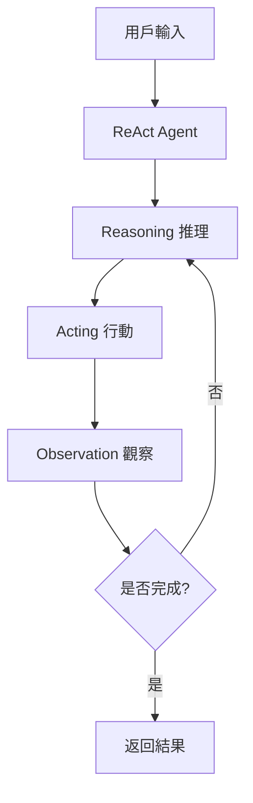

# ReAct Agent 逐行程式碼解析

## 📋 檔案概述

**檔案路徑**: `src/agent/react_agent.py`  
**檔案作用**: 實現 ReAct (Reasoning and Acting) Agent 的核心邏輯  
**設計模式**: 狀態機 + 策略模式  
**核心概念**: Action-Reasoning-Observation 循環

## 🏗️ 整體架構



## 📝 逐行程式碼解析

### 🔧 導入與基礎設定 (第1-11行)

```python
"""
ReAct Agent 核心實現
實現 Action-Reasoning-Observation 循環邏輯
"""
```
**用意**: 檔案文檔字符串，說明此檔案的核心功能

```python
import json
import logging
from typing import Dict, List, Any, Optional
from dataclasses import dataclass
from enum import Enum
```
**用意**: 
- `json`: 處理 JSON 格式數據
- `logging`: 記錄系統運行日誌
- `typing`: 提供類型提示，增強代碼可讀性
- `dataclasses`: 創建數據類，簡化狀態管理
- `enum`: 定義枚舉類型，確保動作類型的一致性

### 🎯 動作類型定義 (第12-18行)

```python
class ActionType(Enum):
    """Agent可執行的動作類型"""
    VALIDATE_INPUT = "validate_input"
    CALL_MCP_TOOL = "call_mcp_tool"
    QUERY_RAG = "query_rag"
    GENERATE_RESPONSE = "generate_response"
    FORMAT_OUTPUT = "format_output"
```

**架構設計**:
- **枚舉模式**: 確保動作類型的唯一性和一致性
- **字符串值**: 便於日誌記錄和調試
- **動作流程**: 定義了 Agent 的完整工作流程

**各動作說明**:
1. `VALIDATE_INPUT`: 驗證用戶輸入的完整性和正確性
2. `CALL_MCP_TOOL`: 調用 MCP 工具獲取紫微斗數命盤
3. `QUERY_RAG`: 查詢 RAG 知識庫獲取相關資料
4. `GENERATE_RESPONSE`: 生成最終的分析回應
5. `FORMAT_OUTPUT`: 格式化輸出結果

### 📊 狀態管理類 (第20-29行)

```python
@dataclass
class AgentState:
    """Agent狀態"""
    current_step: int = 0
    user_input: Dict[str, Any] = None
    mcp_result: Dict[str, Any] = None
    rag_context: List[str] = None
    reasoning_log: List[str] = None
    observations: List[str] = None
    final_response: Dict[str, Any] = None
```

**架構設計**:
- **數據類模式**: 使用 `@dataclass` 自動生成初始化方法
- **狀態追蹤**: 記錄 Agent 執行過程中的所有重要狀態
- **類型安全**: 明確定義每個屬性的類型

**狀態屬性說明**:
- `current_step`: 當前執行步驟編號
- `user_input`: 用戶輸入的原始數據
- `mcp_result`: MCP 工具返回的命盤數據
- `rag_context`: RAG 系統檢索到的知識上下文
- `reasoning_log`: 推理過程的記錄
- `observations`: 觀察結果的記錄
- `final_response`: 最終生成的回應

### 🤖 ReAct Agent 主類 (第31-44行)

```python
class ReActAgent:
    """
    ReAct Agent 主要類別
    實現 Reasoning and Acting 的循環邏輯
    """
    
    def __init__(self, mcp_client, rag_system, claude_client, logger=None):
        self.mcp_client = mcp_client
        self.rag_system = rag_system
        self.claude_client = claude_client
        self.logger = logger or logging.getLogger(__name__)
        self.state = AgentState()
        self.max_iterations = 10
```

**架構設計**:
- **依賴注入模式**: 通過構造函數注入外部依賴
- **組合模式**: 組合多個子系統（MCP、RAG、Claude）
- **狀態管理**: 維護內部狀態對象

**依賴組件**:
- `mcp_client`: MCP 工具客戶端，用於獲取命盤數據
- `rag_system`: RAG 檢索系統，提供知識庫查詢
- `claude_client`: Claude AI 客戶端，用於生成回應
- `logger`: 日誌記錄器，用於調試和監控
- `max_iterations`: 最大迭代次數，防止無限循環

### 🔄 狀態重置方法 (第45-49行)

```python
def reset_state(self):
    """重置Agent狀態"""
    self.state = AgentState()
    self.state.reasoning_log = []
    self.state.observations = []
```

**用意**: 
- **狀態清理**: 為新的執行周期準備乾淨的狀態
- **內存管理**: 避免狀態累積導致的內存洩漏
- **執行隔離**: 確保每次執行都是獨立的

### 🧠 推理方法 (第51-73行)

```python
def reason(self, context: str) -> str:
    """
    推理步驟：分析當前情況並決定下一步行動
    """
    reasoning_prompt = f"""
    當前情況：{context}
    
    請分析當前狀況並決定下一步最合適的行動。
    
    可選行動：
    1. VALIDATE_INPUT - 驗證用戶輸入
    2. CALL_MCP_TOOL - 調用MCP工具獲取紫微斗數
    3. QUERY_RAG - 查詢RAG知識庫
    4. GENERATE_RESPONSE - 生成最終回應
    5. FORMAT_OUTPUT - 格式化輸出
    
    請說明你的推理過程和選擇的行動。
    """
    
    reasoning = self._internal_reasoning(reasoning_prompt)
    self.state.reasoning_log.append(reasoning)
    self.logger.info(f"Reasoning: {reasoning}")
    return reasoning
```

**架構設計**:
- **模板方法模式**: 定義推理的標準流程
- **上下文感知**: 根據當前情況進行推理
- **日誌記錄**: 記錄推理過程便於調試

**推理流程**:
1. 構建推理提示詞
2. 調用內部推理邏輯
3. 記錄推理結果
4. 返回推理結論

### ⚡ 行動執行方法 (第75-97行)

```python
def act(self, action_type: ActionType, **kwargs) -> Any:
    """
    執行行動
    """
    self.logger.info(f"Executing action: {action_type.value}")
    
    if action_type == ActionType.VALIDATE_INPUT:
        return self._validate_input(kwargs.get('user_input'))
    
    elif action_type == ActionType.CALL_MCP_TOOL:
        return self._call_mcp_tool(kwargs.get('birth_data'))
    
    elif action_type == ActionType.QUERY_RAG:
        return self._query_rag(kwargs.get('query'))
    
    elif action_type == ActionType.GENERATE_RESPONSE:
        return self._generate_response(kwargs.get('domain_type'))
    
    elif action_type == ActionType.FORMAT_OUTPUT:
        return self._format_output(kwargs.get('response'))
    
    else:
        raise ValueError(f"Unknown action type: {action_type}")
```

**架構設計**:
- **策略模式**: 根據動作類型選擇不同的執行策略
- **參數傳遞**: 使用 `**kwargs` 靈活傳遞參數
- **錯誤處理**: 對未知動作類型拋出異常

**執行流程**:
1. 記錄即將執行的動作
2. 根據動作類型分發到對應的私有方法
3. 返回執行結果

### 👁️ 觀察方法 (第99-135行)

```python
def observe(self, action_result: Any, action_type: ActionType) -> str:
    """
    觀察行動結果
    """
    observation = f"Action {action_type.value} completed. "
    
    if action_type == ActionType.VALIDATE_INPUT:
        if action_result.get('valid'):
            observation += "Input validation successful."
            self.state.user_input = action_result['data']
        else:
            observation += f"Input validation failed: {action_result.get('error')}"
    
    # ... 其他動作類型的觀察邏輯
    
    self.state.observations.append(observation)
    self.logger.info(f"Observation: {observation}")
    return observation
```

**架構設計**:
- **觀察者模式**: 觀察並記錄每個動作的結果
- **狀態更新**: 根據觀察結果更新 Agent 狀態
- **結果分析**: 分析動作是否成功並提取有用信息

**觀察流程**:
1. 構建基礎觀察描述
2. 根據動作類型和結果詳細分析
3. 更新相應的狀態屬性
4. 記錄觀察結果
5. 返回觀察描述

## 🔄 核心執行邏輯

### 主執行方法 (第137-200行)

```python
def run(self, user_input: Dict[str, Any]) -> Dict[str, Any]:
    """
    執行完整的ReAct循環
    """
    self.reset_state()
    self.logger.info("Starting ReAct agent execution")
    
    # 初始化
    context = f"User request: {user_input}"
    
    for iteration in range(self.max_iterations):
        self.state.current_step = iteration + 1
        self.logger.info(f"ReAct iteration {self.state.current_step}")
        
        # Reasoning
        reasoning = self.reason(context)
        
        # 決定行動
        action_type = self._determine_action(reasoning)
        
        # Acting
        try:
            # ... 根據動作類型執行相應操作
            
        except Exception as e:
            self.logger.error(f"Action execution failed: {str(e)}")
            result = {"success": False, "error": str(e)}
        
        # Observation
        observation = self.observe(result, action_type)
        
        # 更新context為下一次推理
        context = f"Previous action: {action_type.value}, Result: {observation}"
        
        # 檢查是否完成
        if action_type == ActionType.FORMAT_OUTPUT and result.get('success'):
            break
    
    # 返回最終結果或錯誤信息
```

**架構設計**:
- **循環控制**: 實現 ReAct 的核心循環邏輯
- **異常處理**: 捕獲並處理執行過程中的異常
- **上下文傳遞**: 將前一次的結果作為下一次推理的輸入
- **終止條件**: 設定明確的循環終止條件

## 🔧 私有方法解析

### 內部推理邏輯 (第202-216行)

```python
def _internal_reasoning(self, prompt: str) -> str:
    """內部推理邏輯（簡化版）"""
    # 這裡可以使用簡單的規則或調用LLM進行推理
    # 為了示例，使用簡化的規則推理
    
    if not self.state.user_input:
        return "Need to validate user input first. Action: VALIDATE_INPUT"
    elif not self.state.mcp_result:
        return "Need to get ziwei chart data. Action: CALL_MCP_TOOL"
    elif not self.state.rag_context:
        return "Need to query knowledge base. Action: QUERY_RAG"
    elif not self.state.final_response:
        return "Need to generate response. Action: GENERATE_RESPONSE"
    else:
        return "Need to format output. Action: FORMAT_OUTPUT"
```

**架構設計**:
- **規則引擎**: 使用簡單的 if-else 規則進行推理
- **狀態檢查**: 根據當前狀態決定下一步行動
- **順序邏輯**: 按照預定義的順序執行各個步驟

### 動作決定方法 (第218-231行)

```python
def _determine_action(self, reasoning: str) -> ActionType:
    """根據推理結果決定行動"""
    if "VALIDATE_INPUT" in reasoning:
        return ActionType.VALIDATE_INPUT
    elif "CALL_MCP_TOOL" in reasoning:
        return ActionType.CALL_MCP_TOOL
    # ... 其他動作類型的判斷
    else:
        return ActionType.VALIDATE_INPUT  # 默認行動
```

**架構設計**:
- **字符串匹配**: 通過關鍵字匹配決定動作類型
- **默認處理**: 提供默認動作避免未知情況
- **簡單映射**: 將推理結果映射到具體動作

## 🎯 總結

### 設計優點

1. **模組化設計**: 每個功能都有獨立的方法
2. **狀態管理**: 清晰的狀態追蹤和管理
3. **錯誤處理**: 完善的異常處理機制
4. **可擴展性**: 易於添加新的動作類型
5. **可觀測性**: 詳細的日誌記錄和狀態追蹤

### 核心概念

- **ReAct 循環**: Reasoning → Acting → Observation
- **狀態機**: 基於狀態的決策邏輯
- **依賴注入**: 靈活的組件組合
- **策略模式**: 動態選擇執行策略

## 🔍 私有方法詳細解析

### 輸入驗證方法 (第233-257行)

```python
def _validate_input(self, user_input: Dict[str, Any]) -> Dict[str, Any]:
    """驗證用戶輸入"""
    required_fields = ['gender', 'birth_year', 'birth_month', 'birth_day', 'birth_hour', 'domain_type']

    for field in required_fields:
        if field not in user_input:
            return {"valid": False, "error": f"Missing required field: {field}"}

    # 驗證數據格式
    try:
        year = int(user_input['birth_year'])
        month = int(user_input['birth_month'])
        day = int(user_input['birth_day'])

        if not (1900 <= year <= 2100):
            return {"valid": False, "error": "Invalid birth year"}
        if not (1 <= month <= 12):
            return {"valid": False, "error": "Invalid birth month"}
        if not (1 <= day <= 31):
            return {"valid": False, "error": "Invalid birth day"}

    except ValueError:
        return {"valid": False, "error": "Invalid date format"}

    return {"valid": True, "data": user_input}
```

**架構設計**:
- **防禦性編程**: 嚴格驗證所有輸入數據
- **早期失敗**: 一旦發現錯誤立即返回
- **詳細錯誤**: 提供具體的錯誤信息

**驗證邏輯**:
1. **必填欄位檢查**: 確保所有必要欄位都存在
2. **數據類型轉換**: 將字符串轉換為數字並捕獲異常
3. **範圍驗證**: 檢查日期數值的合理範圍
4. **結果返回**: 統一的返回格式

### MCP 工具調用方法 (第259-265行)

```python
def _call_mcp_tool(self, birth_data: Dict[str, Any]) -> Dict[str, Any]:
    """調用MCP工具"""
    try:
        result = self.mcp_client.get_ziwei_chart(birth_data)
        return {"success": True, "data": result}
    except Exception as e:
        return {"success": False, "error": str(e)}
```

**架構設計**:
- **適配器模式**: 封裝外部 MCP 客戶端的調用
- **統一接口**: 提供一致的返回格式
- **異常隔離**: 捕獲並轉換外部異常

**調用流程**:
1. 調用 MCP 客戶端獲取命盤數據
2. 包裝成功結果
3. 捕獲並處理異常

### RAG 查詢方法 (第267-273行)

```python
def _query_rag(self, query: str) -> Dict[str, Any]:
    """查詢RAG系統"""
    try:
        documents = self.rag_system.search(query, top_k=5)
        return {"success": True, "documents": documents}
    except Exception as e:
        return {"success": False, "error": str(e)}
```

**架構設計**:
- **檢索封裝**: 封裝 RAG 系統的檢索邏輯
- **參數控制**: 設定檢索結果數量 (top_k=5)
- **錯誤處理**: 統一的異常處理機制

### 回應生成方法 (第275-290行)

```python
def _generate_response(self, domain_type: str) -> Dict[str, Any]:
    """生成最終回應"""
    try:
        # 準備prompt和數據
        from ..prompts.system_prompts import get_full_prompt_chain

        prompts = get_full_prompt_chain(domain_type)
        context = {
            "ziwei_data": self.state.mcp_result,
            "knowledge_context": self.state.rag_context
        }

        response = self.claude_client.generate_response(prompts, context)
        return {"success": True, "response": response}
    except Exception as e:
        return {"success": False, "error": str(e)}
```

**架構設計**:
- **動態導入**: 按需導入 prompt 模組
- **上下文整合**: 整合命盤數據和知識上下文
- **AI 生成**: 調用 Claude 客戶端生成回應

**生成流程**:
1. 根據領域類型獲取 prompt 鏈
2. 準備包含命盤和知識的上下文
3. 調用 AI 模型生成回應
4. 返回生成結果

### 輸出格式化方法 (第292-310行)

```python
def _format_output(self, response: Any) -> Dict[str, Any]:
    """格式化輸出"""
    try:
        # 確保輸出是有效的JSON格式
        if isinstance(response, str):
            formatted_response = json.loads(response)
        else:
            formatted_response = response

        return {
            "success": True,
            "data": formatted_response,
            "metadata": {
                "reasoning_steps": len(self.state.reasoning_log),
                "observations": len(self.state.observations)
            }
        }
    except Exception as e:
        return {"success": False, "error": f"Output formatting failed: {str(e)}"}
```

**架構設計**:
- **類型檢查**: 處理不同類型的輸入
- **JSON 解析**: 確保輸出為有效的 JSON 格式
- **元數據添加**: 包含執行過程的統計信息

### RAG 查詢生成方法 (第312-320行)

```python
def _generate_rag_query(self) -> str:
    """生成RAG查詢語句"""
    if self.state.mcp_result:
        # 根據紫微斗數結果生成查詢
        main_stars = self.state.mcp_result.get('main_stars', [])
        query = f"紫微斗數 {' '.join(main_stars)} 解釋 分析"
        return query
    else:
        return "紫微斗數 基本概念"
```

**架構設計**:
- **智能查詢**: 根據命盤結果動態生成查詢
- **關鍵字提取**: 提取主星信息作為查詢關鍵字
- **默認查詢**: 提供基礎查詢作為後備

## 📊 數據流分析

### 輸入數據流

```
用戶輸入 → 驗證 → 狀態存儲 → MCP調用 → 命盤數據 → RAG查詢 → 知識上下文 → AI生成 → 格式化輸出
```

### 狀態變化流

```
初始狀態 → 輸入驗證 → MCP結果 → RAG上下文 → 最終回應 → 格式化完成
```

### 錯誤處理流

```
異常捕獲 → 錯誤記錄 → 狀態保持 → 錯誤返回 → 日誌輸出
```

## 🎯 設計模式總結

### 使用的設計模式

1. **狀態機模式**: `AgentState` 管理執行狀態
2. **策略模式**: `act()` 方法根據動作類型選擇策略
3. **模板方法模式**: `run()` 定義執行模板
4. **適配器模式**: 私有方法適配外部服務
5. **觀察者模式**: `observe()` 觀察執行結果

### 架構優勢

1. **可維護性**: 清晰的方法分離和職責劃分
2. **可測試性**: 每個方法都可以獨立測試
3. **可擴展性**: 易於添加新的動作類型和邏輯
4. **可觀測性**: 完整的日誌和狀態追蹤
5. **容錯性**: 全面的異常處理機制

### 使用場景

此 ReAct Agent 適用於需要多步驟推理和行動的複雜任務，特別是：
- 紫微斗數分析流程
- 多數據源整合任務
- 需要中間決策的自動化流程
- 複雜的 AI 工作流程編排

### 改進建議

1. **推理增強**: 可以整合更複雜的推理邏輯或 LLM
2. **並行處理**: 某些步驟可以並行執行以提高效率
3. **緩存機制**: 添加結果緩存減少重複計算
4. **配置化**: 將硬編碼的參數提取為配置項
5. **監控指標**: 添加性能監控和指標收集
